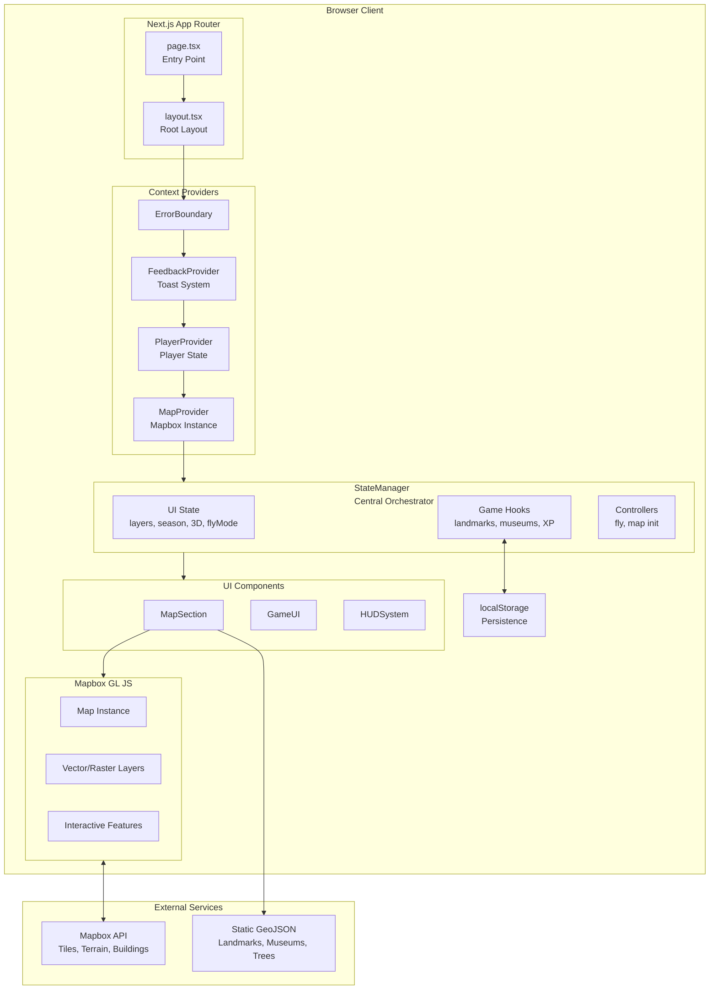
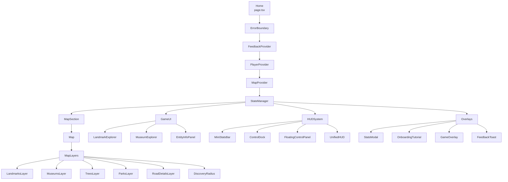
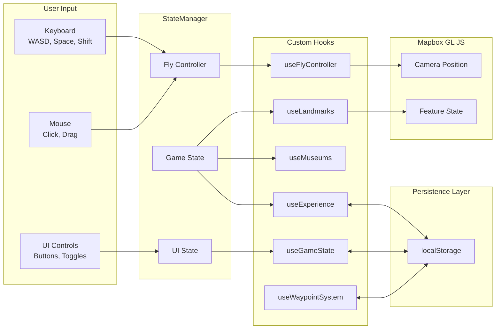
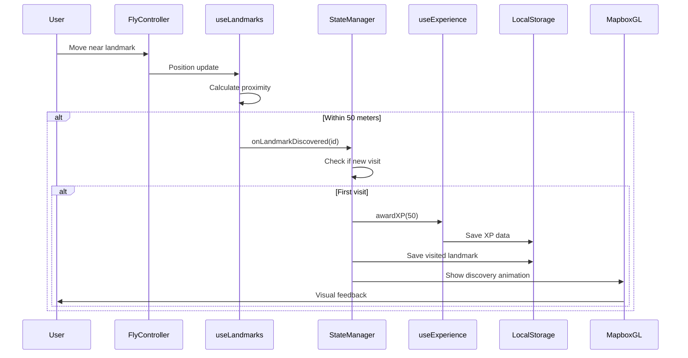

# DC Map

An interactive web application for exploring Washington, D.C. featuring immersive fly-mode navigation, landmark discovery, 3D visualization, and seasonal variations.


## Table of Contents

- [Overview](#overview)
- [Architecture](#architecture)
- [Project Structure](#project-structure)
- [Technology Stack](#technology-stack)
- [Features](#features)
- [Getting Started](#getting-started)
- [Configuration](#configuration)
- [Controls](#controls)
- [Data Sources](#data-sources)
- [Testing](#testing)
- [Deployment](#deployment)
- [License](#license)

## Overview

DC Map is a client-side web application built with Next.js that provides an interactive, game-like experience for exploring Washington, D.C. The application combines mapping capabilities with gamification elements including landmark discovery, experience points, and achievements.

### Key Capabilities

- Real-time 3D map rendering with custom cartoonish styling
- First-person fly navigation with WASD controls
- Landmark and museum discovery system with progress tracking
- Experience points and leveling system
- Seasonal visual variations
- Waypoint system for custom navigation targets
- Persistent game state via localStorage

## Architecture

### High-Level System Architecture



### Component Hierarchy



### State Management Flow



### Landmark Discovery Flow



## Project Structure

```
dc-map/
├── app/                              # Next.js App Router
│   ├── page.tsx                      # Main entry point
│   ├── layout.tsx                    # Root layout with metadata
│   ├── globals.css                   # Global styles
│   ├── types/                        # TypeScript definitions
│   │   ├── map.ts                    # Mapbox-related types
│   │   └── avatar.ts                 # Avatar configuration types
│   ├── lib/                          # Core business logic
│   │   ├── MapContext.tsx            # Mapbox context provider
│   │   ├── playerState.tsx           # Player state (useReducer)
│   │   ├── gameState.ts              # Game progress persistence
│   │   ├── experienceSystem.ts       # XP and leveling system
│   │   ├── FeedbackProvider.tsx      # Toast notification system
│   │   ├── theme.ts                  # Color palettes and theming
│   │   ├── proximity.ts              # Distance and bearing calculations
│   │   ├── waypointSystem.ts         # Waypoint management
│   │   ├── worldBorder.ts            # Game world boundaries
│   │   ├── movementMath.ts           # Movement calculations
│   │   └── achievementTiers.ts       # Achievement definitions
│   ├── hooks/                        # Custom React hooks
│   │   ├── useGameState.ts           # Game state management
│   │   ├── useLandmarks.ts           # Landmark data and proximity
│   │   ├── useMuseums.ts             # Museum data and tracking
│   │   ├── useFlyController.ts       # Fly mode navigation
│   │   ├── useMapInitialization.ts   # Map setup
│   │   ├── useExperience.ts          # Experience system
│   │   ├── useWaypointSystem.ts      # Waypoint management
│   │   └── useContextualHints.ts     # UI hints
│   └── components/                   # React components
│       ├── layout/                   # Layout and state management
│       │   ├── StateManager.tsx      # Central state orchestration
│       │   ├── MapSection.tsx        # Map container
│       │   ├── GameUI.tsx            # Game UI layout
│       │   └── HUDSystem.tsx         # HUD management
│       ├── map/                      # Map components
│       │   ├── Map.tsx               # Main Mapbox component
│       │   ├── MapLayers.tsx         # Layer manager
│       │   ├── FlyModeAvatar.tsx     # Fly mode indicator
│       │   ├── WaypointLayer.tsx     # Waypoint visualization
│       │   ├── effects/              # Visual effects
│       │   │   ├── DiscoveryRadius.tsx
│       │   │   ├── ParticleEffect.tsx
│       │   │   └── BreadcrumbTrail.tsx
│       │   └── layers/               # Data layers
│       │       ├── LandmarksLayer.tsx
│       │       ├── MuseumsLayer.tsx
│       │       ├── TreesLayer.tsx
│       │       ├── ParksLayer.tsx
│       │       └── RoadDetailsLayer.tsx
│       ├── ui/                       # UI components
│       │   ├── EntityInfoPanel.tsx   # Entity details display
│       │   ├── StatsModal.tsx        # Statistics dashboard
│       │   ├── ControlDock.tsx       # Main controls
│       │   ├── FloatingControlPanel.tsx
│       │   ├── OnboardingTutorial.tsx
│       │   ├── FeedbackToast.tsx
│       │   ├── DiscoveryAnimation.tsx
│       │   ├── ProximityHint.tsx
│       │   ├── ErrorBoundary.tsx
│       │   ├── GameOverlay.tsx
│       │   ├── WorldBorderWarning.tsx
│       │   └── hud/
│       │       ├── UnifiedHUD.tsx
│       │       └── MiniStatsBar.tsx
│       └── game/                     # Game components
│           ├── LandmarkExplorer.tsx
│           ├── MuseumExplorer.tsx
│           ├── AchievementToast.tsx
│           └── CompletionNotification.tsx
├── public/                           # Static assets
│   ├── data/                         # GeoJSON data files
│   │   ├── landmarks.geojson         # Landmark locations
│   │   ├── museums.geojson           # Museum locations
│   │   ├── dmv_trees.geojson         # Tree inventory
│   │   ├── dc_walkable_roads.geojson # Road network
│   │   └── walk_graph.json           # Navigation graph
│   ├── icons/                        # SVG and PNG icons
│   └── custom-isometric-style.json   # Custom Mapbox style
├── __tests__/                        # Test files
├── scripts/                          # Build scripts
├── package.json
├── tsconfig.json
├── next.config.js
├── tailwind.config.ts
└── jest.config.js
```

## Technology Stack

| Category | Technology | Version | Purpose |
|----------|------------|---------|---------|
| Framework | Next.js | 15.5 | React meta-framework with App Router |
| Language | TypeScript | 5.6 | Type safety and developer experience |
| UI Library | React | 18.3 | Component-based UI |
| Mapping | Mapbox GL JS | 3.7 | Interactive 2D/3D map rendering |
| Geospatial | Turf.js | 6.5 | Distance, bearing, and spatial calculations |
| Animation | Framer Motion | 11.11 | Component animations and transitions |
| Styling | Tailwind CSS | 3.4 | Utility-first CSS framework |
| Testing | Jest | 29.7 | Unit testing framework |

## Features

### Interactive Map

- Full-screen Mapbox GL JS map centered on Washington, D.C.
- Custom cartoonish/isometric visual style
- 3D building extrusions with real height data
- Terrain elevation and atmospheric sky
- Smooth zoom, pan, rotate, and tilt controls

### Fly Mode Navigation

- First-person flight through D.C. streets
- WASD and arrow key movement controls
- Mouse look for camera rotation
- Space/Shift for altitude control (3-200 meters)
- Momentum-based physics with acceleration/deceleration
- Collision detection with automatic altitude adjustment

### Landmark Discovery System

- 10 iconic D.C. landmarks with descriptions and fun facts
- Proximity-based discovery (50 meter radius)
- Visual feedback with animated discovery effects
- Progress tracking with visited/unvisited states
- Clustering at low zoom levels

### Museum Layer

- 36+ museums from Open Data DC
- Toggle visibility via control panel
- Interactive details on click
- Separate visit tracking

### Experience and Progression

- XP awarded for discoveries (50 XP per landmark, 10 XP per tree)
- Level progression system (100 XP per level)
- Achievement unlocks
- Persistent progress via localStorage

### Seasonal Variations

- Four seasons: Spring, Summer, Fall, Winter
- Dynamic color palette changes
- Seasonal tree icon variations
- Month slider for previewing variations

### Additional Features

- Tree layer with DMV tree inventory data
- Parks layer with seasonal coloring
- Road detail layer with glow effects
- User waypoint system
- World boundary warnings
- Onboarding tutorial for new users

## Getting Started

### Prerequisites

- Node.js 18.0 or higher
- pnpm (recommended) or npm
- Mapbox account with access token

### Installation

1. Clone the repository:

```bash
git clone <repository-url>
cd dc-map
```

2. Install dependencies:

```bash
pnpm install
```

3. Configure environment variables:

```bash
cp env.example .env.local
```

Edit `.env.local` and add your Mapbox access token:

```
NEXT_PUBLIC_MAPBOX_ACCESS_TOKEN=your_mapbox_token_here
```

4. Start the development server:

```bash
pnpm run dev
```

5. Open http://localhost:3000 in your browser.

## Configuration

### Environment Variables

| Variable | Required | Description |
|----------|----------|-------------|
| `NEXT_PUBLIC_MAPBOX_ACCESS_TOKEN` | Yes | Mapbox GL JS access token |
| `NEXT_PUBLIC_MAPBOX_STYLE` | No | Custom Mapbox style URL |

### Build Scripts

| Command | Description |
|---------|-------------|
| `pnpm run dev` | Start development server |
| `pnpm run build` | Create production build |
| `pnpm run start` | Start production server |
| `pnpm run lint` | Run ESLint |
| `pnpm run test` | Run Jest tests |
| `pnpm run build:walk-graph` | Generate navigation graph from road data |

## Controls

### Map View

| Action | Input |
|--------|-------|
| Pan | Click and drag |
| Zoom | Scroll wheel or pinch |
| Rotate | Ctrl + drag |
| Tilt | Right-click + drag |

### Fly Mode

| Action | Input |
|--------|-------|
| Forward | W or Up Arrow |
| Backward | S or Down Arrow |
| Strafe Left | A or Left Arrow |
| Strafe Right | D or Right Arrow |
| Ascend | Space |
| Descend | Shift |
| Look Around | Mouse drag |
| Exit Fly Mode | Escape |

## Data Sources

### Static GeoJSON Files

| File | Description | Source |
|------|-------------|--------|
| `landmarks.geojson` | 10 iconic D.C. landmarks | Curated dataset |
| `museums.geojson` | 36+ museum locations | Open Data DC |
| `dmv_trees.geojson` | Tree inventory | DMV Urban Forestry |
| `dc_walkable_roads.geojson` | Road network | Open Data DC |

### External Services

| Service | Usage |
|---------|-------|
| Mapbox Vector Tiles | Base map, buildings, roads |
| Mapbox Raster DEM | Terrain elevation |
| Mapbox Styles API | Custom map styling |

## Testing

The project uses Jest with ts-jest for unit testing.

```bash
# Run all tests
pnpm run test

# Run tests in watch mode
pnpm run test -- --watch
```

Test files are located in the `__tests__/` directory.

## Deployment

### Vercel (Recommended)

1. Connect your repository to Vercel
2. Configure environment variables in Vercel dashboard
3. Deploy

### Docker

```bash
# Build image
docker build -t dc-map .

# Run container
docker run -p 3000:3000 -e NEXT_PUBLIC_MAPBOX_ACCESS_TOKEN=your_token dc-map
```

### Manual Deployment

```bash
# Build production bundle
pnpm run build

# Start production server
pnpm run start
```

### Requirements

- Node.js runtime
- Environment variables configured
- WebGL-capable client browsers

## License

MIT License

## Author

Prakriti Bista

## Acknowledgments

- Map data and services by [Mapbox](https://www.mapbox.com/)
- Geographic data from [Open Data DC](https://opendata.dc.gov/)
- Tree data from DMV Urban Forestry Division
